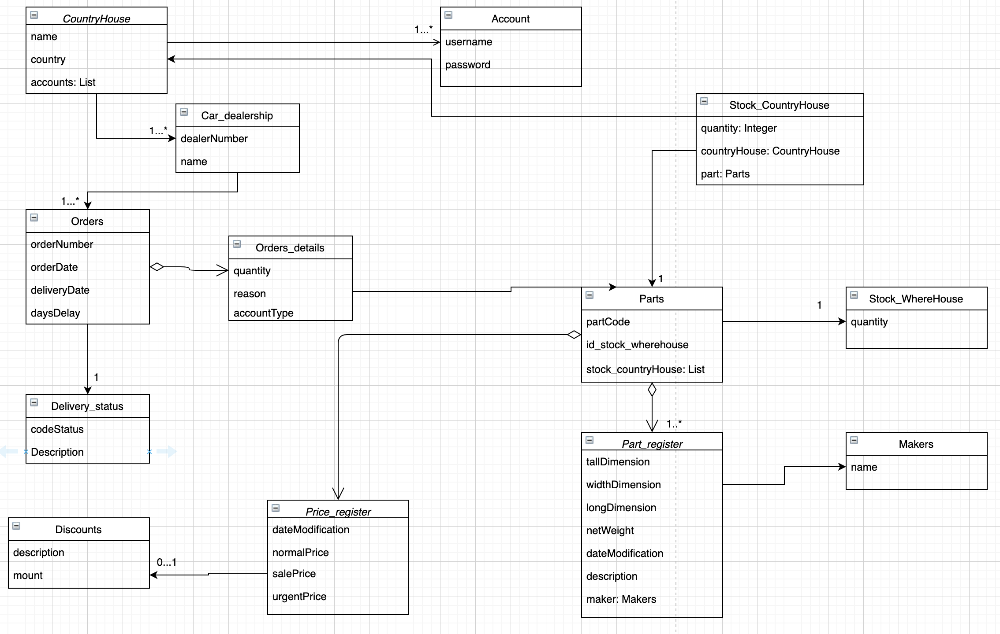

# Proyecto final Bootcamp Mercadolibre

Proyecto final que consiste en una API restful para el bootcamp de Backend realizdo con Java springboot.

## Requerimiento 1: ml-parts-01

Devuelve la lista de los repuestos con sus datos técnicos, precios y descuentos aplicados.

### Endpoint

| Method | Path |Description|
|--------|------|------|
|   GET     | /api/v1/parts/list?     |Retorna una lista de repuestos completa. Si la lista no existe, devuelve un “404 Not Found”.|
|   GET     | /api/v1/parts/list? queryType=[tipo consulta]     |Retorna una lista de repuestos según tipo de consulta.Si la lista no existe, devuelve un “404 Not Found”.|
|   GET     | /api/v1/parts/list? queryType=[tipo consulta] &date=[fecha de consulta]     |Retorna una lista de repuestos según tipo de consulta y fecha seleccionada.Si la lista no existe, devuelve un “404 Not Found”.|
|   GET     | /api/v1/parts/list? queryType=[tipo consulta] &date=[fecha de consulta] &order=[tipo de ordenamiento]    |Retorna una lista de repuestos según tipo de consulta y fecha seleccionada ordenada ascendentemente (1), descendentemente (2) o por última fecha de variación (3). Si la lista no existe, devuelve un “404 Not Found”.|

### Input

| Nombre         | Obligatorio | Descripcion                                                                                      |
|----------------|-------------|--------------------------------------------------------------------------------------------------|
| queryType   | SI          | Tipo de consulta: C: Completa P: Parcial V: Variación de precio |
| date | NO          | Solo para queryType “P” o “V”.|
| order          | NO          | Tipo de orden: 1: Ascendente 2: Descendente 3: Fecha de variación|

### Output

| JSON                                                                                                                                                                                                                                                                                                                                                                                                                                                                                                                                                                                                           |
|----------------------------------------------------------------------------------------------------------------------------------------------------------------------------------------------------------------------------------------------------------------------------------------------------------------------------------------------------------------------------------------------------------------------------------------------------------------------------------------------------------------------------------------------------------------------------------------------------------------|
|  {     "parts":  [     {   "partCode": "01A",              "description": "Puerta derecha de FIAT 600",              "maker": "FIAT",              "quantity": 110,              "discountType": "C20",              "normalPrice": 500.0,              "urgentPrice": 550.0,              "netWeight": 1.0,              "longDimension": 2.0,              "widthDimension": 4.0,              "tallDimension": 3.0,              "lastModification": "2021-04-20"          } ]      } |

## Requerimientos US: ml-parts-02

Devuelve una lista de los pedidos de un concesionario que tiene la central del país que lo solicita a la casa matriz de
Brasil. Si la lista no existe, debe devolver un "404 Not Found".

### Endpoint

| Method | Path                                                                                                   | Description                                                                                                                                                           |
|:------:|--------------------------------------------------------------------------------------------------------|-----------------------------------------------------------------------------------------------------------------------------------------------------------------------|
| GET    | /api/v1/parts/orders?dealerNumber=[nro CE]&deliveryStatus=[estado pedido]                              | Ver una lista de pedidos de un concesionario con el estado de pedido seleccionado.                                                                                    |
| GET    | /api/v1/parts/orders?dealerNumber=[nro CE]&deliveryStatus=[estado pedido]&order=[tipo de ordenamiento] | Ver una lista de pedidos de un concesionario con el estado de pedido seleccionado, ordenado por fecha del pedido. ordenada ascendentemente (1) y descendentemente (2) |
| GET    | /api/v1/parts/orders?dealerNumber=[nro CE]                                                             | Ver una lista de todos los pedidos de un concesionario.                                                                                                               |
| GET    | /api/v1/parts/orders?dealerNumber=[nro CE]&order=[tipo de ordenamiento]                                | Ver una lista de todos los pedidos de un concesionario. ordenada ascendentemente (1) y descendentemente (2).                                                          |

### Input

| Nombre         | Obligatorio | Descripcion                                                                                      |
|----------------|-------------|--------------------------------------------------------------------------------------------------|
| dealerNumber   | SI          | Número del CE (Concesionario) que lo solicita Formato: 0000 (4 caracteres numéricos)             |
| deliveryStatus | NO          | Estado para los pedidos: P: Pendientes de entrega, D: Demorado, F: Finalizados, C: Cancelados |
| order          | NO          | Tipo de orden: 1: Ascendente 2: Descendente                                                     |

### Output

| Nombre       | Descripción                                                                          |                                                                                                            |
|--------------|--------------------------------------------------------------------------------------|------------------------------------------------------------------------------------------------------------|
| dealerNumber | Número del CE (Concesionario) que lo solicita Formato: 0000 (4 caracteres numéricos) |                                                                                                            |
| orders       |                                                                                      |                                                                                                            |
|              | orderNumberCM                                                                        | Numero de Pedido generado por la casa Matriz, formato: [dealerNumber]+[numeroOR]   Ejemplo: 0000-00000008 |
|              | orderDate                                                                            | Fecha de pedido original yyyy-MM-dd                                                                        |
|              | deliveryDate                                                                         | Fecha de entrega programada del pedido, yyyy-MM-dd                                                        |
|              | daysDelayed                                                                          | Cantidad de días demorados, 3 caracteres numéricos                                                         |
|              | deliveryStatus                                                                       | Estado para los pedidos:  P: Pendientes de entrega, D: demorado, F: Finalizados, C: Cancelados             |
| orderDetails |                                                                                      |                                                                                                            |
|              | partCode                                                                             | Código del repuesto 8 dígitos numéricos                                                                    |
|              | description                                                                          | Descripción del repuesto, 100 caracteres alfanuméricos                                                     |
|              | quantity                                                                             | Cantidad del repuesto solicitado en el pedido                                                              |
|              | accountType                                                                          | Tipo de cuenta, R: Repuestos, G: Garantía, 1 carácter                                                      |
|              | reason                                                                               | Motivo por el cual está pendiente el repuesto, 100 caracteres alfanuméricos                                |

## Requerimientos US: ml-parts-03

Devuele un pedido de repuestos según el número de orden de la casa matriz (orderNumberCM)
Si el pedido no existe, debe devolver un “404 Not Found”.

### Endpoint

| Method | Path                                                                                                   | Description                                                                                                                                                           |
|:------:|--------------------------------------------------------------------------------------------------------|-----------------------------------------------------------------------------------------------------------------------------------------------------------------------|
| GET    | /api/v1/parts/orders/{orderNumberCM}          | Ver una lista de pedidos de un concesionario con el estado de pedido seleccionado.                                                                                    |
|
| GET    | /api/v1/parts/orders/{orderNumberCM}?fullInfo=[fullInfo]          | Ver una lista de pedidos con detalles de la orden                                                                                 |
|

### Input

| Nombre         | Obligatorio | Descripcion                                                                                      |
|----------------|-------------|--------------------------------------------------------------------------------------------------|
| orderNumberCM   | SI          | Numero de Pedido generado por la casa Matriz, formato: [dealerNumber]+[numeroCE] Ejemplo: 0000-0000            |
| fullInfo | NO          |  Muestra toda la información del orderDetails si es true, si es false solo muestra orderNumberCE, orderDate y orderStatus |
|

### Output

| Nombre       | Descripción                                                                          |                                                                                                            |
|--------------|--------------------------------------------------------------------------------------|------------------------------------------------------------------------------------------------------------|
| orderNumberCE | Numero de pedido del CE (Concesionario) que lo solicita Formato Nro. Pedido: [numeroCE]+[numeroOR] Ejemplo: 0000-00000008                                                                                                          |
| orderDate       | Fecha de pedido original yyyy-MM-dd
| orderStatus       | Disponibilidad del pedido, P: Procesando, D: demorado, F: Finalizado, C: Cancelado  |                                                                                                            |
| orderDetails |                                                                                      |                                                                                                            |
|              | partCode                                                                             | Código del repuesto 8 dígitos numéricos                                                                    |
|              | description                                                                          | Descripción del repuesto, 100 caracteres alfanuméricos                                                     |
|              | quantity                                                                             | Cantidad del repuesto solicitado en el pedido                                                              |
|              | accountType                                                                          | Tipo de cuenta, R: Repuestos, G: Garantía, 1 carácter                                                      |
|              | reason                                                                               | Motivo por el cual está pendiente el repuesto, 100 caracteres alfanuméricos                                |
## Requerimiento 4: ml-parts-04

Envía un repuesto que tiene en stock la central del país que lo solicita para informarlo a la casa matriz de Brasil
Si se añade satisfactoriamente, devuelve “201 Created” con la referencia a la URI y el contenido de la lista.
Si el repuesto existe actualiza el stock del repuesto ingresado.

### Endpoint

| Method | Path                     |
| ------ | -------------------------|
| POST   | [PATH_APP]/api/v1/parts/ |

### Input

| Nombre         | Obligatorio | Descripción                                           |
| -------------- | ----------- | ----------------------------------------------------- |
| countryHouseId | SI          | Id de la casa país que actualiza su stock             |
| partCode       | SI          | Código del repuesto 8 caracteres numéricos            |
| quantity       | SI          | Cantidad disponible en stock, 8 caracteres numéricos  |

|      |                                                                                                                                      |
| ---- | ------------------------------------------------------------------------------------------------------------------------------------ |
| JSON | {   &nbsp;&nbsp;&nbsp;"countryHouseId": 1,  &nbsp;&nbsp;&nbsp;"partCode" : "02A",  &nbsp;&nbsp;&nbsp;"quantity": 123   } |

### Output

|      |                                                                                                                                                                                                                                                                                                                                                                                    |
| ---- | ---------------------------------------------------------------------------------------------------------------------------------------------------------------------------------------------------------------------------------------------------------------------------------------------------------------------------------------------------------------------------------- |
| JSON | {   &nbsp;&nbsp;&nbsp;"stocks":   &nbsp;&nbsp;&nbsp;[{   &nbsp;&nbsp;&nbsp;&nbsp;&nbsp;&nbsp;"partCode": "01A",   &nbsp;&nbsp;&nbsp;&nbsp;&nbsp;&nbsp;"quantity": 110  &nbsp;&nbsp;&nbsp;},  &nbsp;&nbsp;&nbsp;{  &nbsp;&nbsp;&nbsp;&nbsp;&nbsp;&nbsp;"partCode": "02A", &nbsp;&nbsp;&nbsp;&nbsp;&nbsp;&nbsp;"quantity": 123  &nbsp;&nbsp;&nbsp;}] } |

## Requerimiento 5: ml-parts-05

Permite enviar nuevos pedidos de repuestos que tiene la central del país que lo solicita a la
casa matriz de Brasil. Recibe una lista de objetos que contiene el código, cantidad y la urgencia de recibir el repuesto.
Devuelve 404 si algún código no existe y 400 si no hay cantidad suficiente en el stock del where house para suplir el pedido 0 la cantidad solicitada es menor a 1.
### Endpoint

| Method | Path                     |
| ------ | -------------------------|
| POST   | [PATH_APP]/api/v1/parts/orders |

### Input

| Nombre         | Obligatorio | Descripción                                           |
| -------------- | ----------- | ----------------------------------------------------- |
| partCode       | SI          | Código del repuesto a pedir            |
| quantity       | SI          | Cantidad de repuestos de este código requeridos         |
| urgent         | SI          | Indica si recibir esta parte requiere de urgencia o no |

|      |                                                                                                                                      |
| ---- | ------------------------------------------------------------------------------------------------------------------------------------ |
| JSON | {   &nbsp;&nbsp;&nbsp;"parts": &nbsp;&nbsp;&nbsp; [ { &nbsp;&nbsp;&nbsp;&nbsp;&nbsp;&nbsp;"partCode": "01A",  &nbsp;&nbsp;&nbsp;&nbsp;&nbsp;&nbsp;"quantity": 2,  &nbsp;&nbsp;&nbsp;&nbsp;&nbsp;&nbsp;"urgent": true  &nbsp;&nbsp;&nbsp;&nbsp;&nbsp;&nbsp;},{  &nbsp;&nbsp;&nbsp;&nbsp;&nbsp;&nbsp;"partCode": "0B",  &nbsp;&nbsp;&nbsp;&nbsp;&nbsp;&nbsp;"quantity": 2,  &nbsp;&nbsp;&nbsp;&nbsp;&nbsp;&nbsp;"urgent": false  &nbsp;&nbsp;&nbsp;&nbsp;&nbsp;&nbsp;}]  &nbsp;&nbsp;} |

### Output

|      |                                                                                                                                                                                                                                                                                                                                                                                    |
| ---- | ---------------------------------------------------------------------------------------------------------------------------------------------------------------------------------------------------------------------------------------------------------------------------------------------------------------------------------------------------------------------------------- |
| JSON | {  &nbsp;&nbsp;&nbsp;"total": 2460.0, &nbsp;&nbsp;&nbsp;"parts": &nbsp;&nbsp;&nbsp; [ &nbsp;&nbsp;&nbsp;{ &nbsp;&nbsp;&nbsp;"partCode": "01A", &nbsp;&nbsp;&nbsp;"description": "Puerta derecha de FIAT 600", &nbsp;&nbsp;&nbsp;"maker": "01A", &nbsp;&nbsp;&nbsp;"quantity": 2, &nbsp;&nbsp;&nbsp;"price": 330.0, &nbsp;&nbsp;&nbsp;"total": 660.0 &nbsp;&nbsp;&nbsp;},{ &nbsp;&nbsp;&nbsp;"partCode": "01B", &nbsp;&nbsp;&nbsp;"description": "Volante de lujo", &nbsp;&nbsp;&nbsp;"maker": "01B", &nbsp;&nbsp;&nbsp;"quantity": 2, &nbsp;&nbsp;&nbsp;"price": 900.0, &nbsp;&nbsp;&nbsp;"total": 1800.0 &nbsp;&nbsp;&nbsp;} &nbsp;&nbsp;&nbsp;] &nbsp;&nbsp;&nbsp;}|

## Requerimiento 6: ml-parts-06

COMO casa pais QUIERO a partir de un numero de orden ver el monto total segun los diferentes precios de las partes.
### Endpoint

| Method | Path                     |
| ------ | -------------------------|
| GET   | [PATH_APP]/api/v1/parts/orders/{orderNumberCM=00001-123456}/total |

### Input

| Nombre         | Obligatorio | Descripción                                           |
| -------------- | ----------- | ----------------------------------------------------- |
| OrderNumber    | SI          | Numero de orden que se quiere clacular                |

### Output

|      |                                                                                                                                                                                                                                                                                                                                                                                    |
| ---- | ---------------------------------------------------------------------------------------------------------------------------------------------------------------------------------------------------------------------------------------------------------------------------------------------------------------------------------------------------------------------------------- |
| JSON |
{
 
"totalUrgentPrice": 5500.0,  
"totalSalePrice": 3000.0,  
"totalNormalPrice": 5000.0
 
}

# Diagrama de clases

